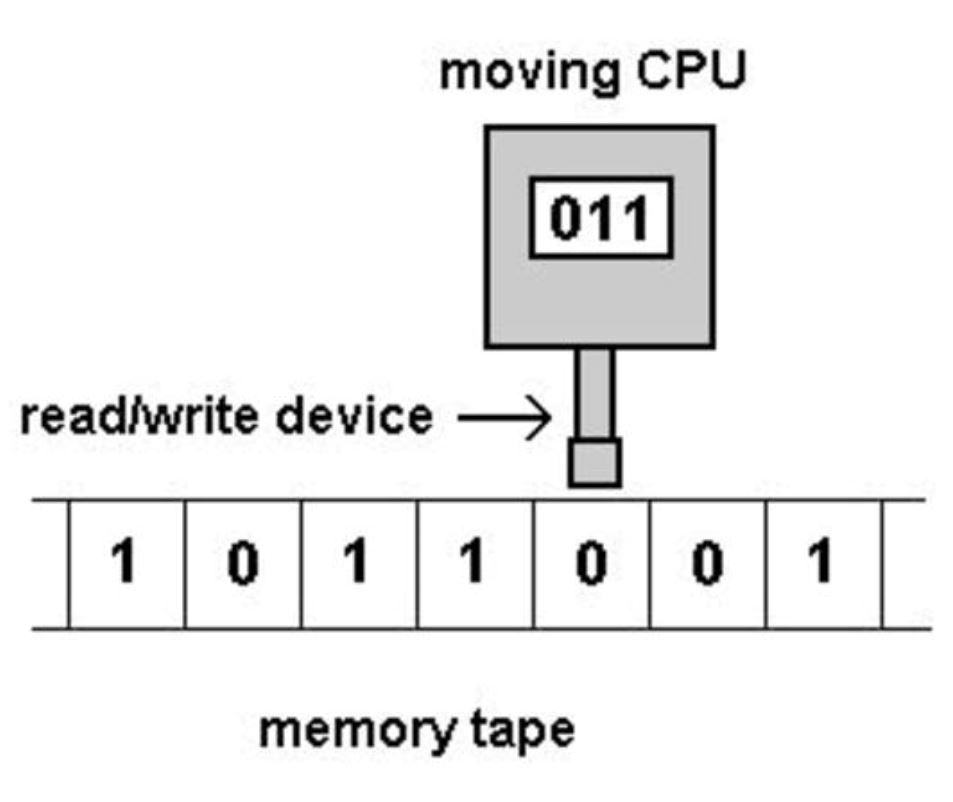

# Taller de autómatas de Introducción a la teoría de la computación 2023-1 (Python 3)

<p align="center">
  
</p>

Este proyecto es una implementación en Python 3.10.7 de varios tipos de autómatas y máquinas de Turing complementado con su representación gráfica usando la biblioteca NetworkX. Los tipos de autómatas implementados son:

- Autómata Finito Determinista (AFD)
- Autómata Finito No Determinista (AFN)
- Autómata Finito No Determinista con Transiciones Lambda (AFN-λ)
- Autómata Finito con Pila Determinista (AFPD)
- Autómata Finito con Dos Pilas (AF2P)
- Autómata Finito con Pila No Determinista (AFPN)
- Máquina de Turing (MT)
## Instalación

Para probar y utilizar este proyecto, sigue los siguientes pasos:
1. Clona este repositorio en tu máquina local utilizando el siguiente comando:

```bash
git clone https://github.com/CesarFRR/Taller_2_ITC
```
2. Ya dentro de los archivos usando algun IDE o también VsCode tendremos que instalar el requirements, el cual se hace de la siguiente manera:

```bash
pip install -r requirements.txt
```

Si la Instalación de requirements no funciona, se tendrá que instalar manualmente las librerias que practicamente son solo dos, y se instalan así:

```bash
pip install prettytable

pip install networkx
```

## Clases main
Las clases main o clases principales,son aquellas a las que se puede acceder al control de todo el proyecto, asi como también para las pruebas de las funcionalidades.

Hay dos archivos que cumplen como clases main.

```bash
Interfaz.py
InterfazCLI.py
```
Interfaz.py --> Es la principal, ya que brinda una interfaz gráfica e intuitiva, además de contar con todas las funcionalidades de los autómatas.

InterfazCLI.py --> Es una interfaz de consola, diseñada para ejecutar y probar todos los métodos que tienen en común los autómatas de estos talleres, los cuales son.

```bash
1. procesarCadena()
2. procesarCadenaConDetalles()
3. procesarListaCadenas()
4. Mostrar la información del autómata --> toString()
5. Mostrar los grafos (se exportará un archivo pdf a /archivosSalida)
```

## Authors

- [Juan Montoya (Hallip)](https://github.com/Hallip)
- [César Rincon (CesarFRR)](https://github.com/CesarFRR)
- [Johan Rodriguez (Homeroso)](https://github.com/Homeroso)
- [Anzola Tachak (ganzola)](https://github.com/ganzola)

